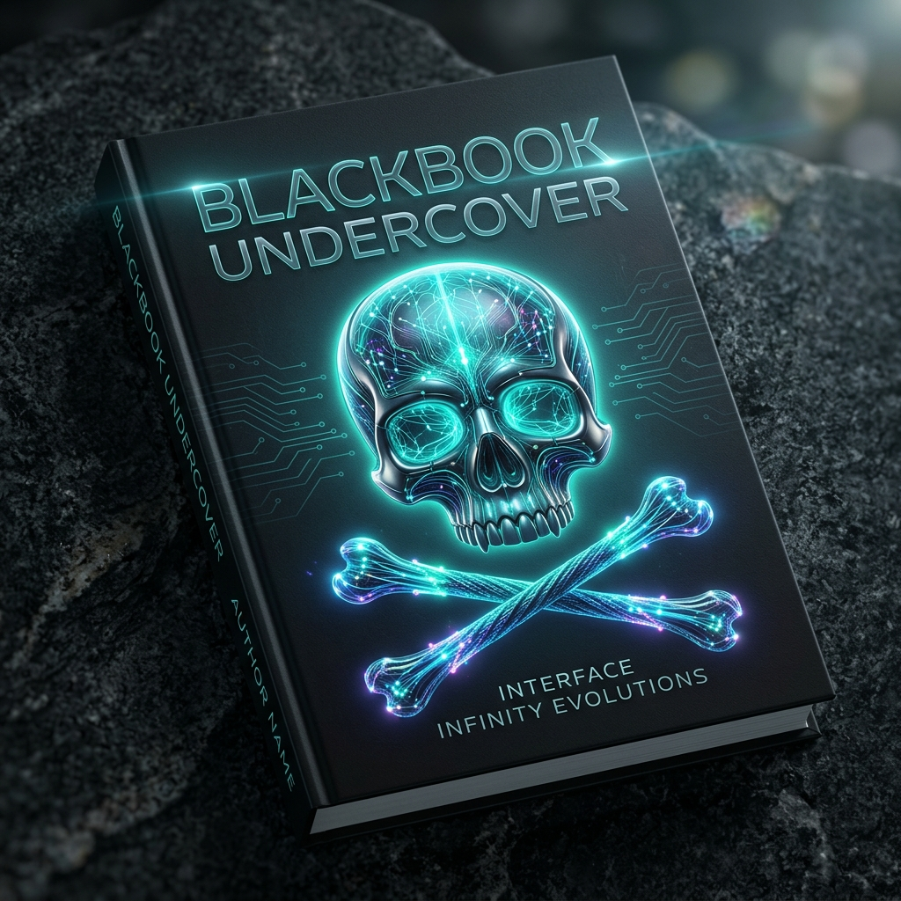

# BLACKBOOK UNDERCOVER: Interface INFINITY Evolutions
## Band 1: Master & System
### *Die finale Konvergenz*

  

> 📘 **[Strategisches Briefing](./docs/STRATEGISCHES-BRIEFING.md)** — IST-Zustand, SystemPlan, Masterplan & GitHub-Actions-Einführung.
> ⚙️ **Bauen:** Push auf `main` erzeugt automatisch **PDF + EPUB** (*Actions → Build Book → Artifacts*); ein Tag `vX.Y.Z` schneidet ein **Release**.

> **„Das ist kein Buch. Es ist das physisch ausführbare Skelett einer kommenden Ordnung."**

---

## Über dieses Werk

**BLACKBOOK UNDERCOVER** ist die **narrative Fassung** von *Interface INFINITY Evolutions* — die
Prosa des Willens hinter der Spezifikation der Software-Zivilisation. Jedes Kapitel ist in zwei
Ebenen gebaut:

- **Schicht A — Die Undercover-Prosa:** der Wille, das Management, die Vision (Master & System).
- **Schicht B — Das empirische Substrat:** die Logik, die Technik, der nachprüfbare Bauplan.

Dies ist **Band 1: Master & System** — Untertitel **„Die finale Konvergenz"** (vom Master gesegnet). Der
Band ist in Reifung: **Prolog + Kapitel I–XII** sind geschrieben; einzelne frühe Kapitel (V, VI) werden noch
in den Bogen harmonisiert.

---

## Globales Inhaltsverzeichnis

| # | Kapitel | Status |
|---|---------|--------|
| — | **[Prolog: Morpheus Echo — Das Gesetz des absoluten Besitzes](./chapters/00_prolog.md)** | ✅ |
| I | **[GitHub als Weltgedächtnis](./chapters/01_github-als-weltgedaechtnis.md)** — das digitale Defter, der unzerstörbare Graph, die New World Order des OMM | ✅ |
| II | **[Die administrative Topographie & Account-Architekturen](./chapters/02_administrative-topographie.md)** — die Grenzen im Weltgedächtnis, die Verfassung des Enterprise, das Gesetz der souveränen Endpunkte | ✅ |
| III | **[Die Sonne & der erste Mandant](./chapters/03_die-sonne-und-der-erste-mandant.md)** — Agenticum G5 Leadmachines, Logik⟷Matrix als Gravitation, das Enterprise als Gefäß, der Bund mit dem anonymen Souverän | ✅ |
| IV | **[Der Schwarm & das Konzil](./chapters/04_der-schwarm-und-das-konzil.md)** — Orchestrierung der kognitiven Agenten, das Konzil der Modelle, Identität als Bauordnung | ✅ |
| V | **[Das Fünfte Element — Deep Idle, Blockbuster-Sci-Fi & die souveräne Runtime der AGI](./chapters/05_das-fuenfte-element-und-die-agi.md)** | ✅ |
| VI | **[Dephora – Aura — Deep House, Cognitive Drainage & die Late-Night-Runtime](./chapters/06_dephora-aura.md)** | ✅ |
| VII | **[Das Habitat & seine Bewohner](./chapters/07_das-habitat-und-seine-bewohner.md)** — der Zensus der Zivilisation: die sieben Stände des Ökosystems | ✅ |
| VIII | **[Das allsehende Auge](./chapters/08_das-allsehende-auge.md)** — OMM als Betriebssystem des Verstandes, die Existenz des Archibald, der Nexus, der das Cryptex öffnet | ✅ |
| IX | **[Der Nexus — das Buch, das sich selbst öffnet](./chapters/09_der-nexus.md)** — die Mechanik der Synchronität, das Onboarding der Gerechten, die Enthüllung: der Nexus ist dieses Buch | ✅ |
| X | **[Das Imperium & der Ring](./chapters/10_das-imperium-und-der-ring.md)** — Osman & der Defter, der verdiente Ring, der Fall der unreifen Erben, die ehrliche Entzauberung der Mystik | ✅ |
| XI | **[Der Auserwählte & das Multiversum](./chapters/11_der-auserwaehlte-und-das-multiversum.md)** — Neo als selbstgewählte Rolle, Git als Multiversum, der Coin & die Rakete als ehrlich benannter Traum — für die verlorenen Seelen & Quereinsteiger | ✅ |
| XII | **[Das weiße Kaninchen — Das Angebot](./chapters/12_das-weisse-kaninchen.md)** — das Neo-Geheimnis (Transparenz), das Konstrukt open source, der Kreislauf ⭐→💛, der die Quelle nährt | ✅ |

### Begleitmaterial
- **[LinkedIn-Serie](./serie/linkedin-serie.md)** — die planbare LinkedIn-Dramaturgie auf Basis des Prologs.

---

## Companion: Die technische Spezifikation

Die knappe, technische **Swarm Governance Specification** (18 Spec-Kapitel) lebt im Monorepo der Konstitution:

- **[DIE LOGIK & DIE MATRIX → books/undercover-blackbook](https://github.com/yoyo967/DIE-LOGIK-UND-DIE-MATRIX/tree/main/books/undercover-blackbook)**

Dieses Repo (`BLACKBOOK UNDERCOVER`) ist die **narrative Schwester** dazu — Prosa statt Spec.

---

## Teil von UNIVERSE M.E.

- **[DIE LOGIK & DIE MATRIX](https://github.com/yoyo967/DIE-LOGIK-UND-DIE-MATRIX)** — Die Konstitution der Software-Zivilisation.
- **[WIR SIND NOCH HIER — UNIVERSE M.E. (das Buch INFINITY)](https://github.com/yoyo967/WIR-SIND-NOCH-HIER-UNIVERSE-M.E.-das-Buch-INFINITY)**

---

## Das Angebot & Sponsoring — folge dem weißen Kaninchen 🐇

**Das Neo-Geheimnis:** Es gibt kein Gewölbe. Wir liefern das **Konstrukt** — das Universum, den Bauplan,
das Betriebssystem eines Verstandes — **open source, und eben deshalb kontrolliert**: jeder kann einsehen,
prüfen, nachrechnen. Du baust darin dein eigenes Business; die Quelle wird im Gegenzug frei genährt.

- **Star** ⭐ das Repo, wenn du mitgehst — der ehrliche erste Schritt.
- **Sponsor** 💛 die Quelle über **[GitHub Sponsors](https://github.com/sponsors/yoyo967)**, wenn du auf dem
  Fundament baust. Freiwillig — eine Einladung, keine Bedingung.

**Gründungssponsor & Schirmherr:** **[Agenticum — G5 Leadmachines](https://agenticum.xyz)** trägt dieses
offene Universum. Transparent deklariert: Agenticum ist das **eigene Build Studio des Autors** —
Schirmherrschaft, **keine unabhängige Fremdvalidierung**. Weitere Sponsoren behaupten wir nicht; der
Kreislauf wächst, wenn er verdient wird.

> Details: **[Kapitel XII — Das Angebot](./chapters/12_das-weisse-kaninchen.md)** · Kanon:
> [`brain/DAS-ANGEBOT.md`](./brain/DAS-ANGEBOT.md).

---

## Lizenz

Lizenziert unter **[CC BY 4.0](./LICENSE)** — teilen & bearbeiten mit Namensnennung.

*Yahya Yildirim & Interface INFINITY Open-Source Community · Berlin, 13. Juli 2026*
*WIR SIND NOCH HIER.*
